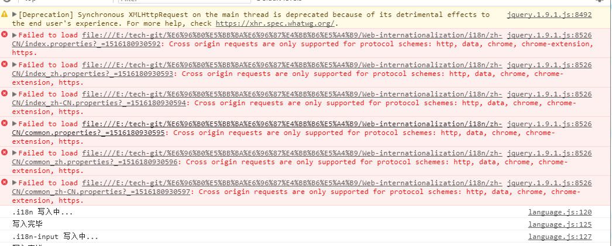

"# Web-internationalization" 

## 最近demo在google上面运行会出现报错的情况

这个主要是google浏览器为了安全性考虑，默认对跨域访问禁止。

## 解决方法
给浏览器传入启动参数（allow-file-access-from-files），允许跨域访问。

Windows下，运行（CMD+R）或建立快捷方式：

	"C:\Program Files (x86)\Google\Chrome\Application\chrome.exe" --allow-file-access-from-files

然后重启google就可以了。

当然，如果你不想修改这些你也可以在其他浏览器里面测试比如IE。
